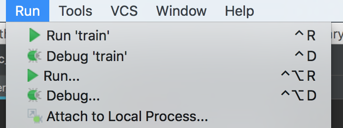
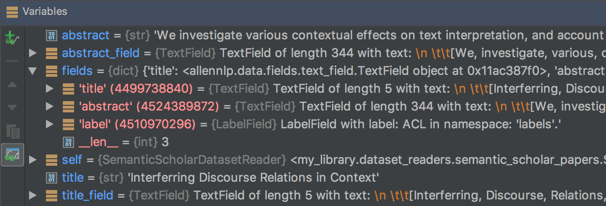
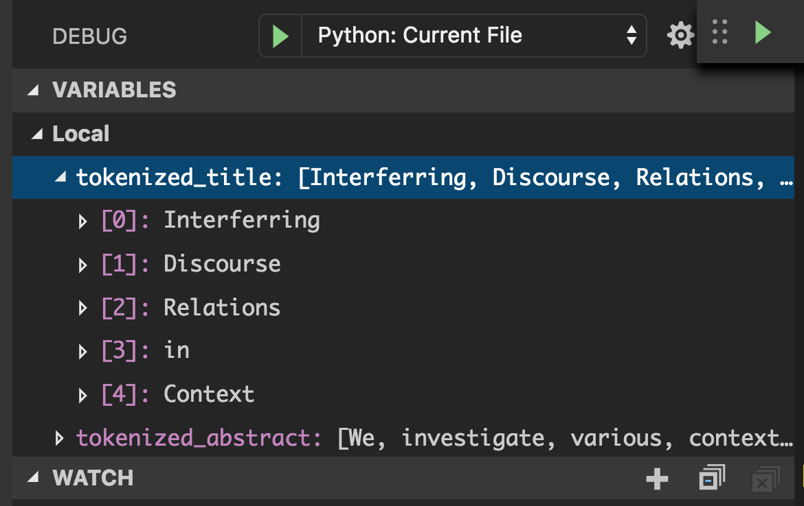
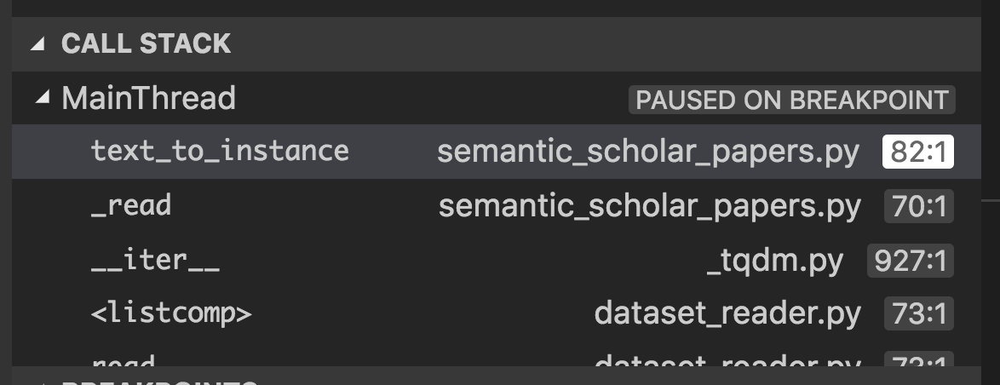

# How to Debug AllenNLP

Recently several people have asked how to debug allennlp code
using PyCharm, so I set out to figure it out. It turns out that
it's not terribly difficult. It's also easy to do it in VSCode.

If you have a different preferred debugger,
these instructions will probably work for you too.

# Some Code To Debug

We'll demonstrate the debugger using the Academic Paper Classifier model
from our ["AllenNLP-as-a-Library" example](https://github.com/allenai/allennlp-as-a-library-example).

If you'd like to follow along, clone that repo and install its requirements.

# How to Debug in PyCharm, Using "Run > Attach to Local Process"

Our recommended workflow is using our command-line tool `allennlp`.
The example repo contains the training command:

```
allennlp train experiments/venue_classifier.json -s /tmp/your_output_dir_here --include-package my_library -o '{"trainer": {"cuda_device": -1}}'
```

(I added an override to train on the CPU, since the machine you're running PyCharm on probably doesn't have a GPU.)

It turns out that `allennlp` is just (in essence) an alias for `python -m allennlp.run`, so you could equivalently do

```
python -m allennlp.run train experiments/venue_classifier.json -s /tmp/your_output_dir_here --include-package my_library -o '{"trainer": {"cuda_device": -1}}'
```

After which you can select "Run > Attach to Local Process",



search for the one that's running `allennlp`,


and get results in the debugger:


# How to Debug in PyCharm, Using "Run > Debug"

Some people find the "attach to local process" workflow to be a nuisance,
especially if you are repeatedly debugging things.

Fortunately, it's easy to launch the training process from code,
using `allennlp.commands.main()`.

First, create a wrapper script that puts your command-line args into `sys.argv` and calls `main()`. In the academic paper classifier example, I could use the following:

```python
import json
import shutil
import sys

from allennlp.commands import main

config_file = "experiments/venue_classifier.json"

# Use overrides to train on CPU.
overrides = json.dumps({"trainer": {"cuda_device": -1}})

serialization_dir = "/tmp/debugger_train"

# Training will fail if the serialization directory already
# has stuff in it. If you are running the same training loop
# over and over again for debugging purposes, it will.
# Hence we wipe it out in advance.
# BE VERY CAREFUL NOT TO DO THIS FOR ACTUAL TRAINING!
shutil.rmtree(serialization_dir, ignore_errors=True)

# Assemble the command into sys.argv
sys.argv = [
    "allennlp",  # command name, not used by main
    "train",
    config_file,
    "-s", serialization_dir,
    "--include-package", "my_library",
    "-o", overrides,
]

main()
```

Then you can set a breakpoint somewhere in your code:


Right-click in the editor and choose "Debug":


And then once you hit your breakpoint, you can inspect variables or step through code to your heart's content:



# How to Debug in VSCode

You can use the same debug wrapper script as in the previous section.

Then click on the debug icon all the way on the left,


select "Python > Current File" as the debugging profile,


set a breakpoint somewhere,


and select "Debug > Start Debugging" from the menu.


Your code will run in the integrated terminal, and when you hit
your breakpoint you'll be able to inspect variables



and the call stack



and whatever else you need to do to debug your code.

Happy debugging!
